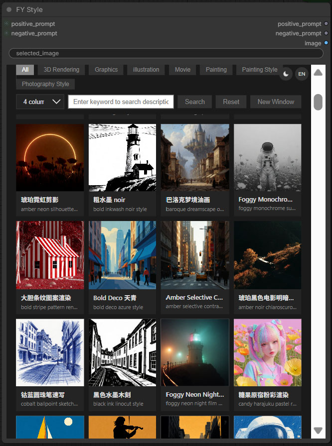
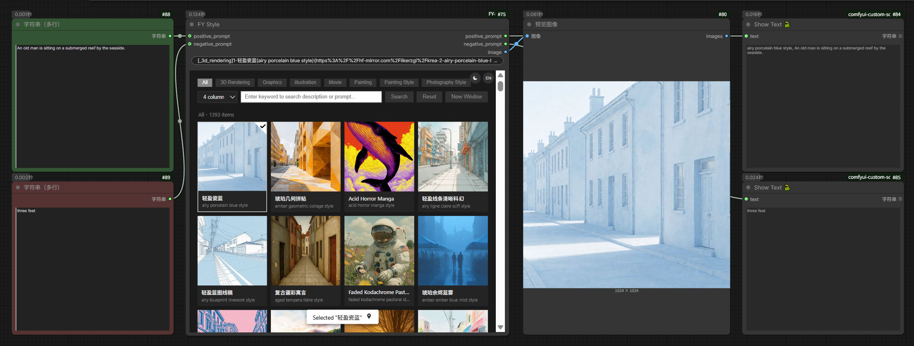
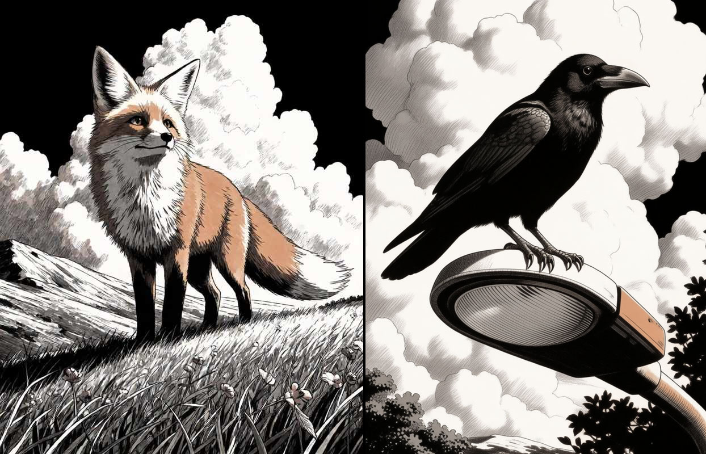
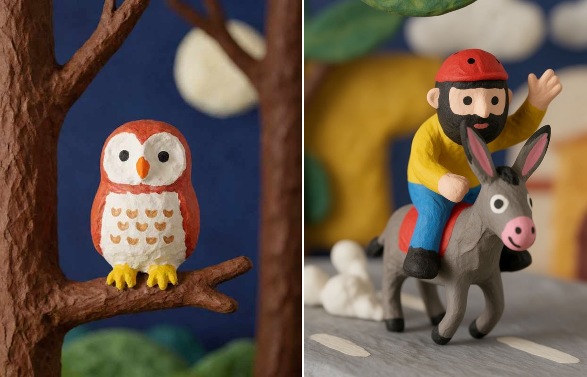
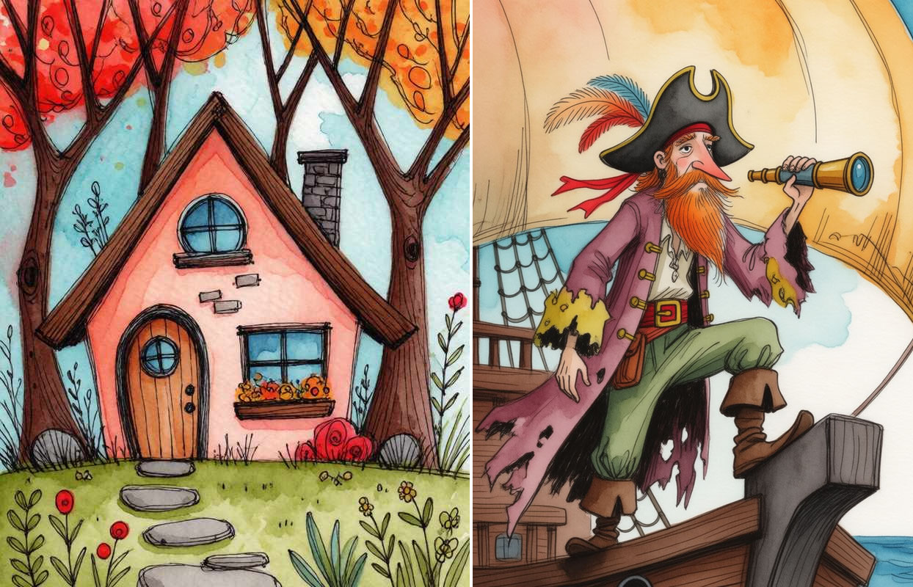
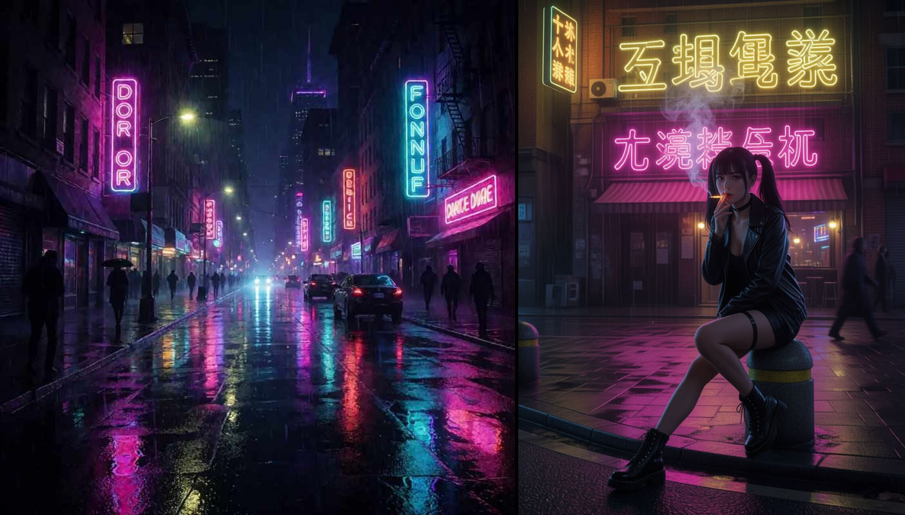
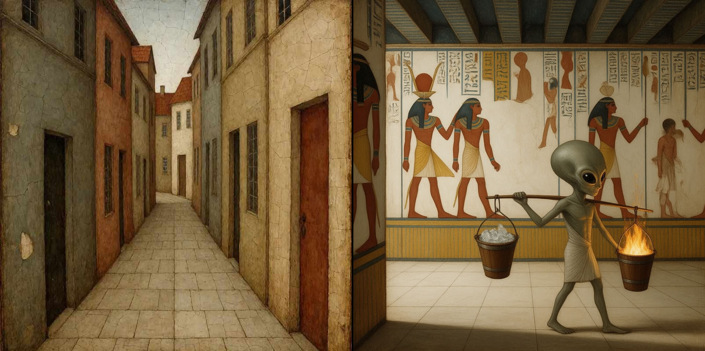

# ComfyUI-FY-Style

> 简单实用的参考图懒人专属方案 — 1000+ 精选风格，并且每张图附带精准的简易提示词。

[English instructions](README.md)

---

## 简介

**FY Style** 是一款ComfyUI本地化图集插件，提供内置的风格参考图画廊。每张参考图都配有可直接使用的简化提示词。

- **1000+ 风格参考图**，精选自开源项目 [fal-Krea-2-Style-LoRA](https://huggingface.co/fal/krea-2-style-lora)
- **灵活的分类浏览与搜索**，支持标签筛选和全文检索
- **中英文双语支持**，语言偏好自动保存
- **一键注入提示词** — 选中的图片提示词自动追加到你的工作流中

---

## 快速上手

1. 将插件安装到 ComfyUI 的 `custom_nodes/` 目录
2. 重启 ComfyUI
3. 在工作流中添加 **FY Style** 节点
4. 打开节点内嵌的画廊面板
5. 浏览或搜索你想要的风格，点击选中
6. 节点自动输出选中的图片 + 对应提示词（可选），直接连接你的图像生成模型即可

---

## 工作流节点





---

## 参考生图效果展示

下图使用了 **Krea-2 模型** 结合 **[ComfyUI-Krea2-StyleTransfer](https://github.com/jieg9341-lab/ComfyUI-Krea2-StyleTransfer)** 插件来生成（这是一款针对Krea2模型的优秀参考图插件，感谢作者的开源！）。

### 左为原图，右为生成图













---

## 文件说明

| 路径 | 说明 |
|------|------|
| `__init__.py` | 插件入口 |
| `nodes.py` | 核心节点实现 |
| `update.py` | HTML 生成器 — 解析 `img/` 目录文件名，生成 `index.html` 画廊页面 |
| `js/main.js` | ComfyUI 前端扩展 — 嵌入画廊 iframe，处理跨帧消息通信 |
| `lang/` | 内含中英文语言包（UI 字符串 + 分类翻译） |
| `img/` | 风格参考图目录（命名规范：`[_tag]N-名称(提示词){URL}.ext`） |
| `img/fal-Krea-2-Style-LoRAs-image.tar.gz` | 图集压缩包（首次启动节点时会自动解压） |
| `workflows/` | 示例 ComfyUI 工作流 |
| `index.html` | 生成的画廊页面（由 `update.py` 自动生成） |
| `update.bat` | Windows 批处理脚本，运行 `update.py` 刷新画廊 |

---

## 图片命名规范

你可以自定义风格图片，请放在`img/`目录下，风格参考图的命名请遵循以下格式：

```
[_tag]N-中文名称(English prompt ---- negative prompt){URL}.ext
```

| 部分 | 示例 | 说明 |
|------|------|------|
| `[_tag]` | `[_3d_rendering]` | 分类标签（对应语言包 `classify` 的键） |
| `N-` | `1-` | 序号 |
| `中文名称` | `轻盈瓷蓝` | 中文显示名称（UI 中展示） |
| `(English prompt)` | `(airy porcelain blue style)` | 简化正向提示词 |
| `----` | `(Minimalist cyan line style ---- ambiguous, chaotic)` | 正负向提示词分隔符 |
| `{URL}` | `{https://hf-mirror.com/...}` | 来源链接（自动解码显示） |

添加新图片后，运行 `update.py`（或双击 `.bat` 文件）重新生成 `index.html`。

---

## 风格图片生图方案参考

- **Krea-2 模型** — [krea2_turbo_bf16.safetensors](https://modelscope.cn/models/krea/Krea-2-Turbo)
- **[ComfyUI-Krea2-StyleTransfer](https://github.com/jieg9341-lab/ComfyUI-Krea2-StyleTransfer)** — 参考图风格迁移插件，由 [jieg9341-lab](https://github.com/jieg9341-lab) 开源

---

## 许可

本插件仅供个人及社区使用。风格参考图来源于开源 LoRA 项目。